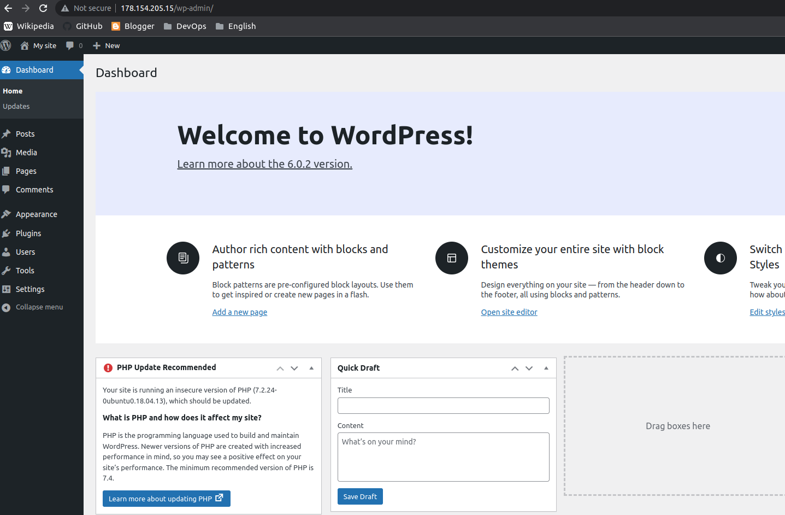
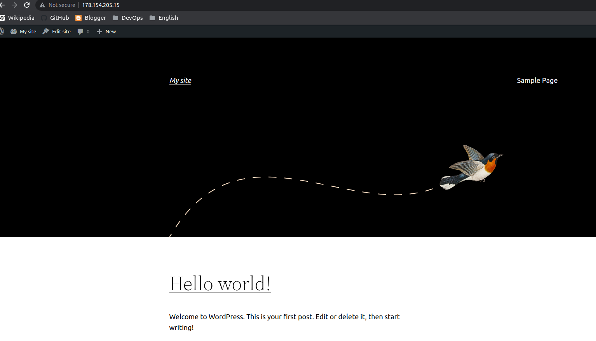

# Homework09

In this homework I:

 - [x] write Python dynamic inventory script that parse `terraform output`
 - [x] write and use Ansible role

ansible logs:
```
ansible-playbook playbooks/install.yml
[WARNING]: Skipping plugin (/home/irqoff/.pyenv/versions/3.10.7/envs/3.10.7-ansible/lib/python3.10/site-packages/ansible/plugins/callback/selective.py) as it seems to be invalid: cannot import name 'codeCodes'
from 'ansible.utils.color' (/home/irqoff/.pyenv/versions/3.10.7/envs/3.10.7-ansible/lib/python3.10/site-packages/ansible/utils/color.py)

PLAY [wp_app] *****************************************************************************************************************************************************************************************************

TASK [Gathering Facts] ********************************************************************************************************************************************************************************************
ok: [app]
ok: [app2]

TASK [wordpress : Update apt-get repo and cache] ******************************************************************************************************************************************************************
ok: [app]
ok: [app2]

TASK [wordpress : install dependencies] ***************************************************************************************************************************************************************************
ok: [app]
ok: [app2]

TASK [wordpress : Create the installation directory] **************************************************************************************************************************************************************
ok: [app]
ok: [app2]

TASK [wordpress : Install WordPress] ******************************************************************************************************************************************************************************
ok: [app]
ok: [app2]

TASK [wordpress : Copy file with owner and permissions] ***********************************************************************************************************************************************************
ok: [app]
ok: [app2]

TASK [wordpress : Enable URL rewriting] ***************************************************************************************************************************************************************************
ok: [app]
ok: [app2]

TASK [wordpress : Enable the site] ********************************************************************************************************************************************************************************
changed: [app]
changed: [app2]

TASK [wordpress : Disable the default “It Works” site] ************************************************************************************************************************************************************
changed: [app]
changed: [app2]

TASK [wordpress : Reload service apache2] *************************************************************************************************************************************************************************
changed: [app]
changed: [app2]

TASK [wordpress : Install mysql cert] *****************************************************************************************************************************************************************************
ok: [app]
ok: [app2]

TASK [wordpress : Update cert index] ******************************************************************************************************************************************************************************
changed: [app]
changed: [app2]

TASK [wordpress : Configure WordPress] ****************************************************************************************************************************************************************************
ok: [app]
ok: [app2]

PLAY RECAP ********************************************************************************************************************************************************************************************************
app                        : ok=13   changed=4    unreachable=0    failed=0    skipped=0    rescued=0    ignored=0 
app2                       : ok=13   changed=4    unreachable=0    failed=0    skipped=0    rescued=0    ignored=0 
```

Result:




