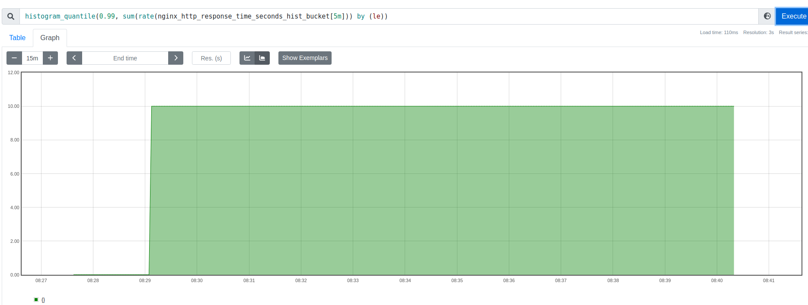
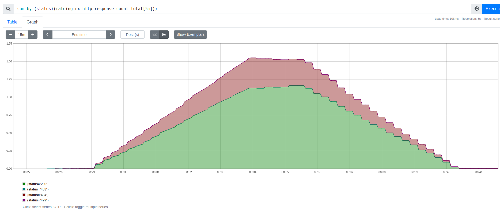
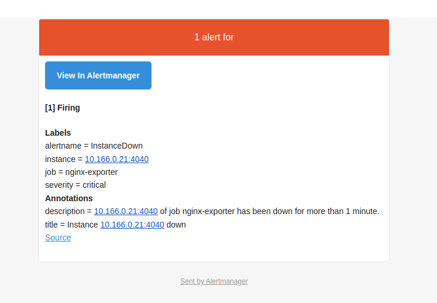

# Homework 02

Apple Terraform configuration:
```
terraform apply
```

Generate Ansible inventory:
```
echo -e "[nginx]\n$(terraform output nginx_ip|tr -d \")\n\n[prometheus]\n$(terraform output prometheus_ip|tr -d \")\n\n[prometheus:vars]\nnginx_ip=$(terraform output nginx_internal_ip|tr -d \")" > hosts
```

Install PostgreSQL:
```
ansible-playbook -i hosts main.yml -u ubuntu -e 'gmail_auth_password=app_password'
```

Login:
```
ssh -L 9090:localhost:9090 ubuntu@$(terraform output prometheus_ip|tr -d \")
```

## Prometheus metrics

Run siege on prometheus:
```
siege $(grep 4040 /srv/prometheus.yml|cut -f 2 -d : | cut -f 2 -d \")
```

Then run PromQL query:
```
histogram_quantile(0.99, sum(rate(nginx_http_response_time_seconds_hist_bucket[5m])) by (le))
```


and
```
sum by (status)(rate(nginx_http_response_count_total[5m]))
```


## Go exporter

Save my exporter metric:
```
ssh ubuntu@$(terraform output prometheus_ip|tr -d \") curl -s localhost:8000/metrics > irqoff_exporter.out
```
file - [file](./irqoff_exporter.out)

## Alertmanager

Shut down nginx exporter:
```
docker stop nginx-exporter
```
Check gmail account - 
