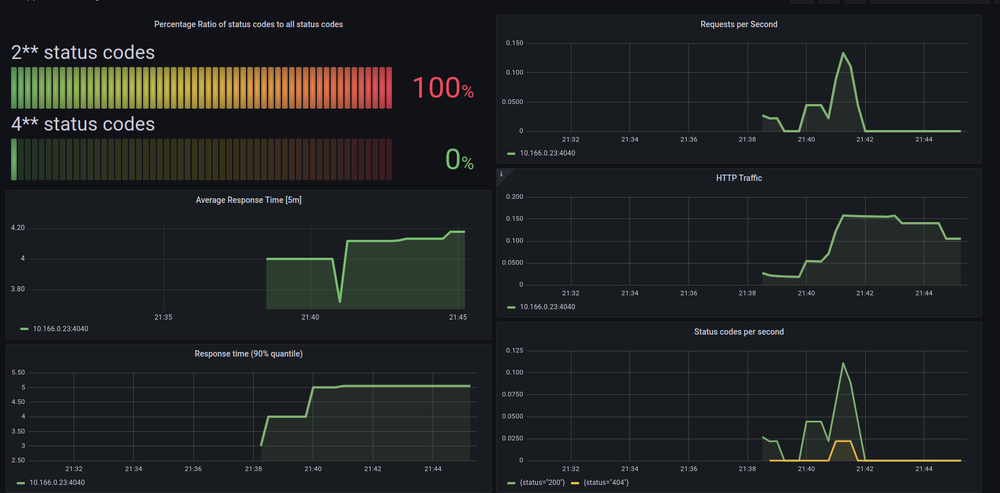
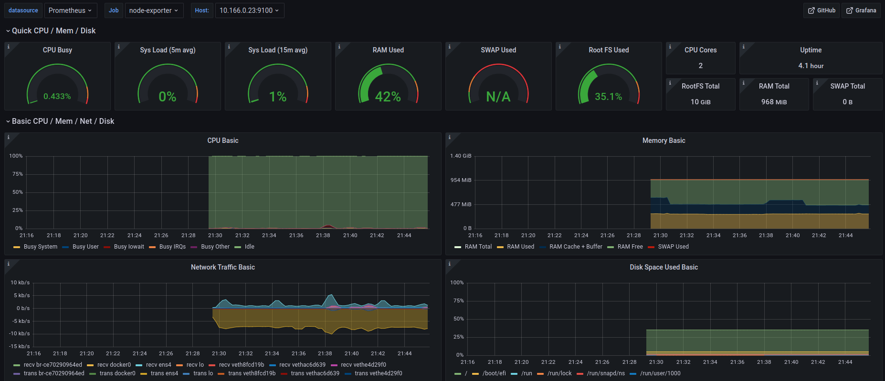
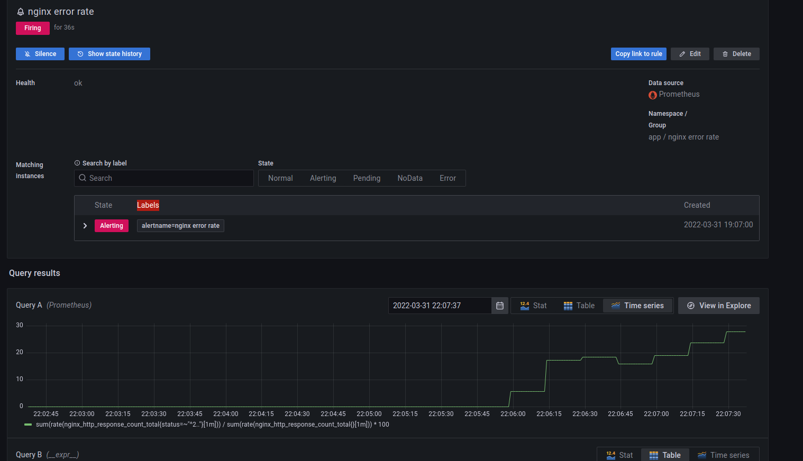
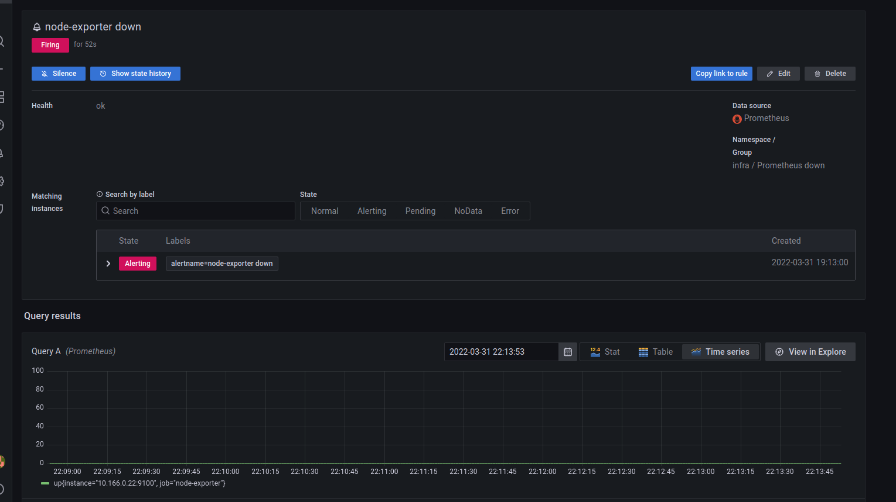
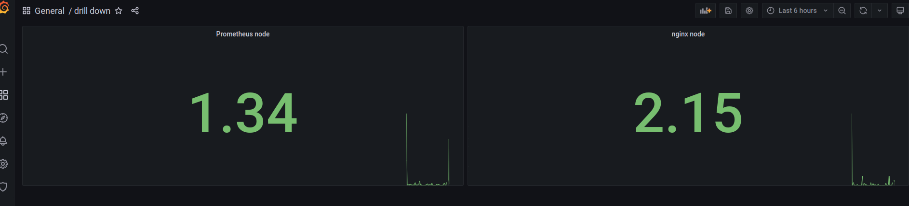

# Homework 08

Apple Terraform configuration:
```
terraform apply
```

Generate Ansible inventory:
```
echo -e "[nginx]\n$(terraform output nginx_ip|tr -d \")\n\n[prometheus]\n$(terraform output prometheus_ip|tr -d \")\n\n[prometheus:vars]\nnginx_ip=$(terraform output nginx_internal_ip|tr -d \")" > hosts
```

Install PostgreSQL:
```
ansible-playbook -i hosts main.yml -u ubuntu
```

Login:
```
ssh -L 9090:localhost:9090 -L 3000:localhost:3000 ubuntu@$(terraform output prometheus_ip|tr -d \")
```

Then I create two directories and export node-exporter full and nginxlog dashboard:





## Alerts

Nginx alert metric:
```
sum(rate(nginx_http_response_count_total{status=~"^2.."}[1m])) / sum(rate(nginx_http_response_count_total{}[1m])) * 100
```

Infra alert metric:
```
up{}
```





## Drill down

Use data link to create the drill down dashboard:


