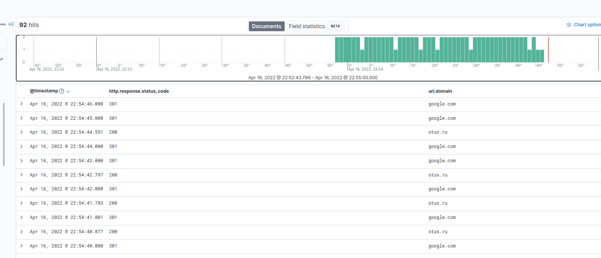
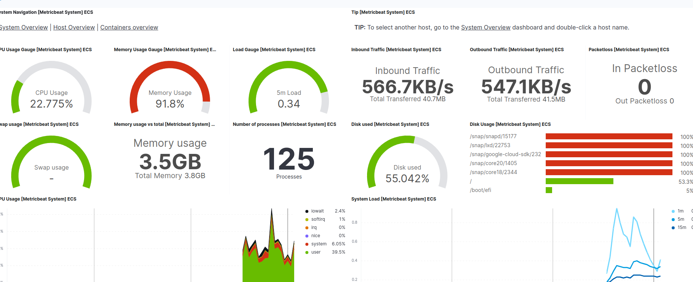
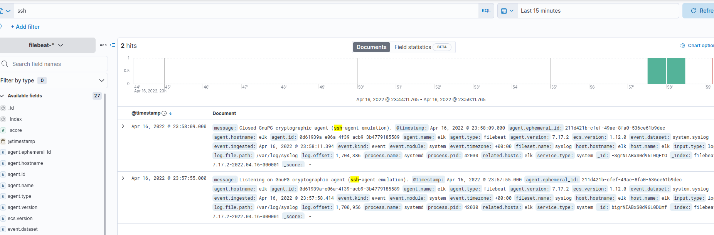

# Homework 11

Apple Terraform configuration:
```
terraform apply
```

Generate Ansible inventory:
```
echo -e "[elk]\n$(terraform output elk_ip|tr -d \")" > hosts
```

Install PostgreSQL:
```
ansible-playbook -i hosts main.yml -u ubuntu --skip-tags heartbeat,metricbeat,filebeat
```

Login:
```
ssh -L 5601:localhost:5601 ubuntu@$(terraform output elk_ip|tr -d \")
```

## Elasticsearch

Generate token:
```
docker exec elasticsearch bin/elasticsearch-create-enrollment-token --scope kibana
```

And get the password:
```
docker exec -it elasticsearch bin/elasticsearch-reset-password -u elastic
```

Now we can create API token in Kibana: http://localhost:5601

And check Elasticsearch status:
```
root@elk:/home/ubuntu# curl https://localhost:9200/_cluster/health -sk -H "Authorization: ApiKey TOKEN" | jq .
{
  "cluster_name": "docker-cluster",
  "status": "green",
  "timed_out": false,
  "number_of_nodes": 1,
  "number_of_data_nodes": 1,
  "active_primary_shards": 10,
  "active_shards": 10,
  "relocating_shards": 0,
  "initializing_shards": 0,
  "unassigned_shards": 0,
  "delayed_unassigned_shards": 0,
  "number_of_pending_tasks": 0,
  "number_of_in_flight_fetch": 0,
  "task_max_waiting_in_queue_millis": 0,
  "active_shards_percent_as_number": 100
}
```

## Heartbeat

Install Heartbeat:
```
ansible-galaxy role install nephelaiio.heartbeat
ansible-playbook -i hosts main.yml -u ubuntu -t heartbeat  -e 'es_password=PASS'
```

and run setup:
```
heartbeat setup -e
```



## Metricbeat

Install Metricbeat:
```
ansible-galaxy role install nephelaiio.metricbeat
ansible-playbook -i hosts main.yml -u ubuntu -t metricbeat -e 'es_password=PASS'
```

and `run` setup:
```
metricbeat setup --index-management --dashboards
```



## Filebeat

Install Heartbeat:
```
ansible-galaxy role install nephelaiio.filebeat
ansible-playbook -i hosts main.yml -u ubuntu -t filebeat -e 'es_password=PASS'
```

and `run` setup:
```
filebeat setup --dashboards --index-management
```



