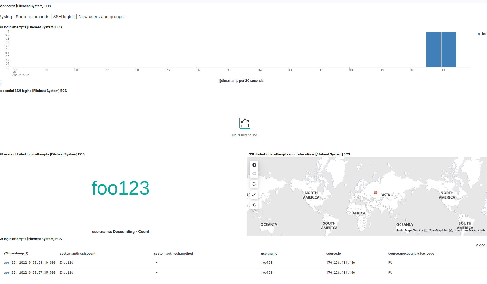
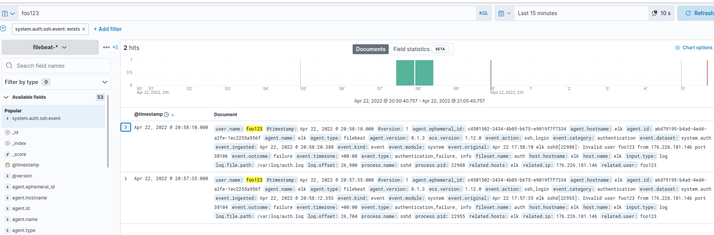

# Homework 11

Apple Terraform configuration:
```
terraform apply
```

Generate Ansible inventory:
```
echo -e "[elk]\n$(terraform output elk_ip|tr -d \")" > hosts
```

Install PostgreSQL:
```
ansible-playbook -i hosts main.yml -u ubuntu --skip-tags filebeat
```

Login:
```
ssh -L 5601:localhost:5601 ubuntu@$(terraform output elk_ip|tr -d \")
```

## Elasticsearch

Generate token:
```
docker exec elasticsearch bin/elasticsearch-create-enrollment-token --scope kibana
```

And get the password:
```
docker exec -it elasticsearch bin/elasticsearch-reset-password -u elastic
```

and verification code:
```
docker logs kibana
```

## Filebeat

Install Filebeat:
```
ansible-galaxy role install nephelaiio.filebeat
ansible-playbook -i hosts main.yml -u ubuntu -t filebeat -e 'es_password=PASS'
```

and `run` setup:
```
filebeat setup --dashboards --index-management
```



