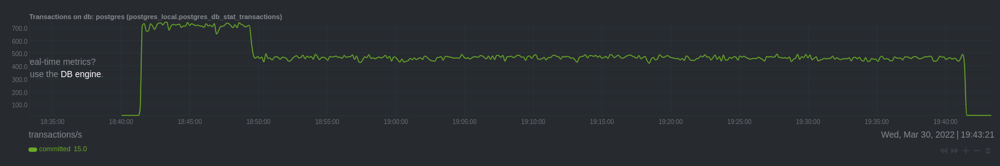
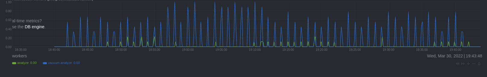
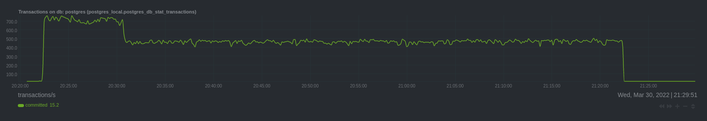
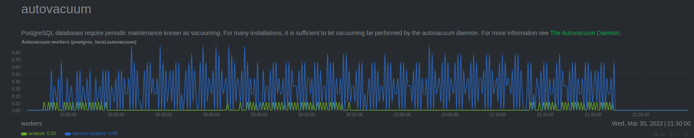

# Homework 02

Apple Terraform configuration:
```
terraform apply
```

Generate Ansible inventory:
```
echo -e "[dbservers]\n$(terraform output nat_ip|tr -d \")" > hosts
```

Install PostgreSQL:
```
ansible-playbook -i hosts main.yml -u ubuntu
```

Open SSH sessions:
```
ssh ubuntu@$(terraform output nat_ip|tr -d \")
```
Run pgbench:
```
pgbench -i postgres
pgbench -c8 -P 60 -T 3600 -U postgres postgres
```
Results:



Destroy VM and repease with tuned configuration:
```
terraform destroy
terraform apply
ansible-playbook -i hosts main.yml -u ubuntu -e 'config_prefix=_tuned'
pgbench -i postgres
pgbench -c8 -P 60 -T 3600 -U postgres postgres
```
Results:



## Conclusion

Performance depends little on autovacuum if you have bottle neck on disk writing.
