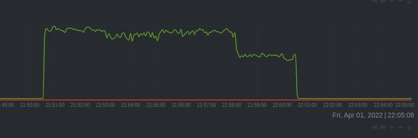
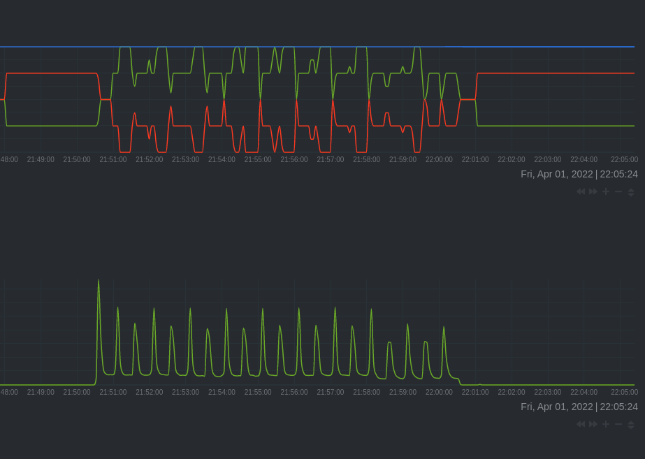
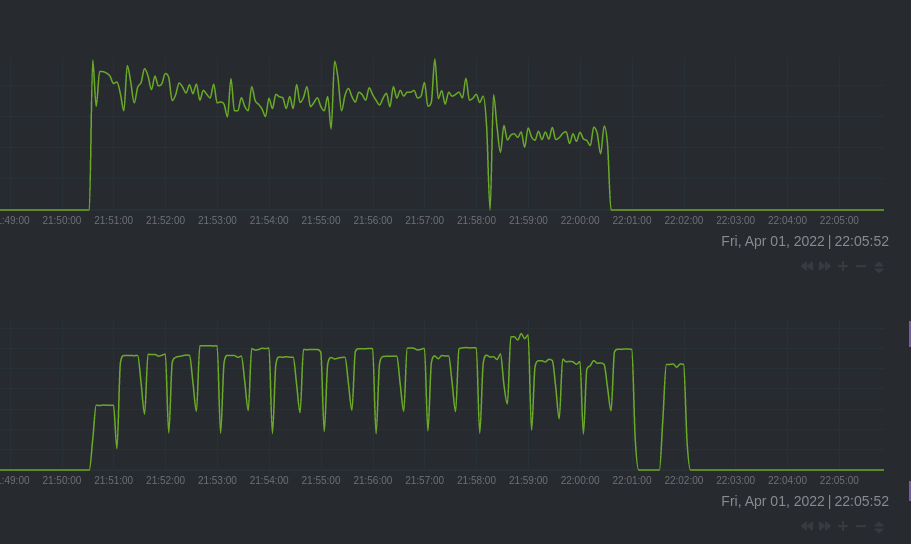
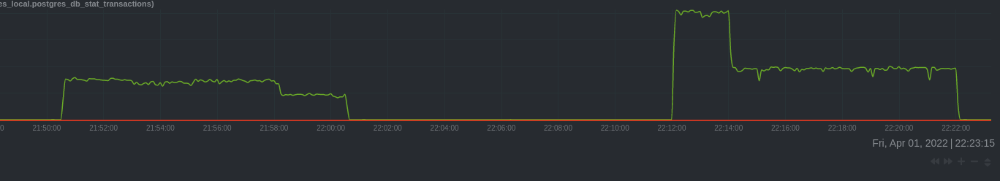

# Homework 09

Apple Terraform configuration:
```
terraform apply
```

Generate Ansible inventory:
```
echo -e "[dbservers]\n$(terraform output nat_ip|tr -d \")" > hosts
```

Install PostgreSQL:
```
ansible-playbook -i hosts main.yml -u ubuntu
```

Open SSH sessions:
```
ssh -L 19998:localhost:19999 ubuntu@$(terraform output nat_ip|tr -d \")
```

Change checkpoint_timeout:
```
sed -i 's@#checkpoint_timeout = 5min@checkpoint_timeout = 30s@' /etc/postgresql/14/main/postgresql.conf
systemctl restart postgresql
```

Run pgbench and collect statistics:
```
pgbench -i postgres
psql -c '\x' -c "SELECT pg_stat_reset_shared('bgwriter');" -c 'SELECT * FROM pg_stat_bgwriter;' -c 'SELECT pg_current_wal_insert_lsn();'
Expanded display is on.
-[ RECORD 1 ]--------+-
pg_stat_reset_shared | 

-[ RECORD 1 ]---------+------------------------------
checkpoints_timed     | 0
checkpoints_req       | 0
checkpoint_write_time | 0
checkpoint_sync_time  | 0
buffers_checkpoint    | 0
buffers_clean         | 0
maxwritten_clean      | 0
buffers_backend       | 0
buffers_backend_fsync | 0
buffers_alloc         | 0
stats_reset           | 2022-04-01 18:50:26.085782+00

-[ RECORD 1 ]-------------+-----------
pg_current_wal_insert_lsn | 0/3721CF58

pgbench -c 8 -P 60 -T 600 -U postgres postgres

number of transactions actually processed: 395400
latency average = 12.137 ms
latency stddev = 12.640 ms
initial connection time = 23.865 ms
tps = 659.001644 (without initial connection time)

 psql -c '\x'  -c 'SELECT * FROM pg_stat_bgwriter;' -c 'SELECT pg_current_wal_insert_lsn();'
Expanded display is on.
-[ RECORD 1 ]---------+------------------------------
checkpoints_timed     | 32
checkpoints_req       | 0
checkpoint_write_time | 593159
checkpoint_sync_time  | 197
buffers_checkpoint    | 41876
buffers_clean         | 0
maxwritten_clean      | 0
buffers_backend       | 2564
buffers_backend_fsync | 0
buffers_alloc         | 2559
stats_reset           | 2022-04-01 18:50:26.085782+00

-[ RECORD 1 ]-------------+-----------
pg_current_wal_insert_lsn | 0/53B74880


postgres=# SELECT pg_size_pretty('0/53B74880'::pg_lsn - '0/3721CF58'::pg_lsn);
 pg_size_pretty 
----------------
 457 MB
(1 row)
```
checkpoints_req is zero.








This happened because min_wal_size and max_wal_size are to small for current checkpoint_timeout. We can increase checkpoints_req or decrease min_wal_size and max_wal_size.

## Synchronous and Asynchronous Commit

Change configuration and run pgbench again:
```
sed -i 's@#synchronous_commit = on@synchronous_commit = off@' /etc/postgresql/14/main/postgresql.conf
systemctl restart postgresql

pgbench -c 8 -P 60 -T 600 -U postgres postgres

number of transactions actually processed: 695137
latency average = 6.904 ms
latency stddev = 19.229 ms
initial connection time = 24.310 ms
tps = 1158.494601 (without initial connection time)
```



## Checksum

Recreate the cluster:
```
systemctl stop postgresql
rm -rf /var/lib/postgresql/14/main/
mkdir /var/lib/postgresql/14/main/
/usr/lib/postgresql/14/bin/initdb -k /var/lib/postgresql/14/main
systemctl start postgresql
```

Create a database and fill it:
```
create database otus;
\c otus

CREATE TABLE test(
   id SERIAL PRIMARY KEY,
   name VARCHAR NOT NULL
);

insert into test (
    name
)
select
    md5(random()::VARCHAR)
from generate_series(1, 1000000);

otus=# select count(*) from test;
  count  
---------
 1000000
(1 row)
```

Now damage it:
```
otus=# SELECT pg_relation_filepath('test');
 pg_relation_filepath 
----------------------
 base/16384/16386
(1 row)

root@postgresql:/var/lib/postgresql/14/main/base/16384# dd if=/dev/urandom of=/var/lib/postgresql/14/main/base/16384/16386 seek=10 count=1 bs=8k
1+0 records in
1+0 records out
8192 bytes (8.2 kB, 8.0 KiB) copied, 0.000389577 s, 21.0 MB/s
```

We got the error when read it now:
```
otus=# select sum(id) from test;
WARNING:  page verification failed, calculated checksum 63934 but expected 11544
ERROR:  invalid page in block 10 of relation base/16384/16386
```

We can set ignore_checksum_failure and zero_damaged_pages to ignore this:
```
otus=# SET ignore_checksum_failure = on;
SET
otus=# set zero_damaged_pages=on;
SET
otus=# select count(*) from test;
WARNING:  page verification failed, calculated checksum 63934 but expected 11544
WARNING:  invalid page in block 10 of relation base/16384/16386; zeroing out page
 count 
-------
  1200
(1 row)
```
