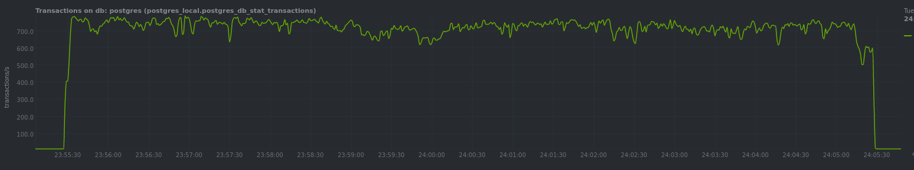
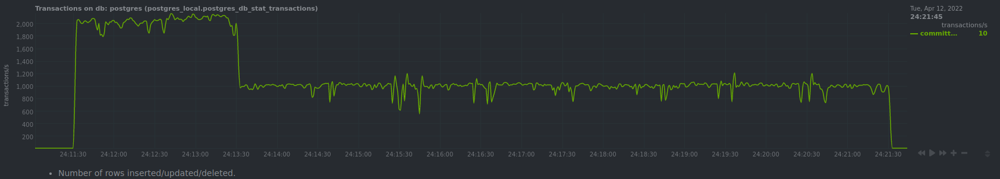
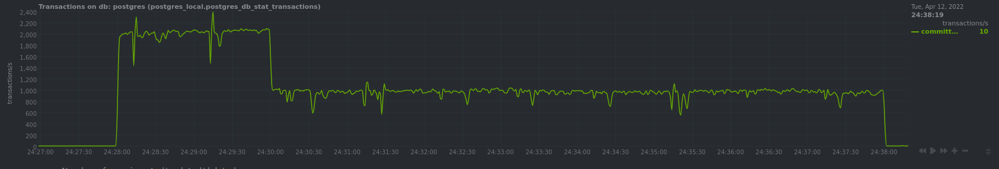
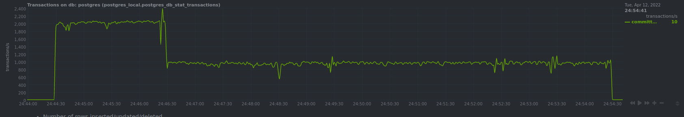

# Homework 08

Apple Terraform configuration:
```
terraform apply
```

Generate Ansible inventory:
```
echo -e "[dbservers]\n$(terraform output nat_ip|tr -d \")" > hosts
```

Install PostgreSQL:
```
ansible-playbook -i hosts main.yml -u ubuntu
```

## Default configuration

[Configuration file](./postgresql.conf)

Run pgbench:
```
ssh -L 19998:localhost:19999 ubuntu@$(terraform output nat_ip|tr -d \")
pgbench -i postgres
postgres@postgresql:~$ pgbench -c8 -P 30 -T 600 -U postgres postgres
```
Result:
```
latency average = 11.752 ms
latency stddev = 10.931 ms
initial connection time = 23.016 ms
tps = 680.615373 (without initial connection time)
```


## PGTune (web profile)

[Configuration file](./postgresql_pgtune.conf)

Update config:
```
ansible-playbook -i hosts main.yml -u ubuntu -e 'config_prefix=_pgtune'
```
Run pgbench:
```
postgres@postgresql:~$ pgbench -c8 -P 30 -T 600 -U postgres postgres

Result:
```
latency average = 11.258 ms
latency stddev = 6.864 ms
initial connection time = 26.536 ms
tps = 710.480038 (without initial connection time)
```



## fsync off

[Configuration file](./postgresql_fsync.conf)

Update config: 
```
ansible-playbook -i hosts main.yml -u ubuntu -e 'config_prefix=_fsync'
```
Run pgbench:
```
postgres@postgresql:~$ pgbench -c8 -P 30 -T 600 -U postgres postgres

Result:
```
latency average = 6.671 ms
latency stddev = 18.853 ms
initial connection time = 24.361 ms
tps = 1198.802152 (without initial connection time)
```



## synchronous commit off

[Configuration file](./postgresql_asynchronous.conf)

Update config:
```
ansible-playbook -i hosts main.yml -u ubuntu -e 'config_prefix=_asynchronous'
```
Run pgbench:
```
postgres@postgresql:~$ pgbench -c8 -P 30 -T 600 -U postgres postgres

Result:
```
latency average = 6.862 ms
latency stddev = 19.345 ms
initial connection time = 29.403 ms
tps = 1165.450563 (without initial connection time)
```



## Aggressive

[Configuration file](./postgresql_all.conf)

Update config:
```
ansible-playbook -i hosts main.yml -u ubuntu -e 'config_prefix=_all'
```
Run pgbench:
```
postgres@postgresql:~$ pgbench -c8 -P 30 -T 600 -U postgres postgres

Result:
```
latency average = 6.876 ms
latency stddev = 19.264 ms
initial connection time = 32.515 ms
tps = 1163.251067 (without initial connection time)
```



## Conclusion

PGTune gives about 5% performance improvement, when `synchronous commit = off` is the most save and effective setting for high tps.
